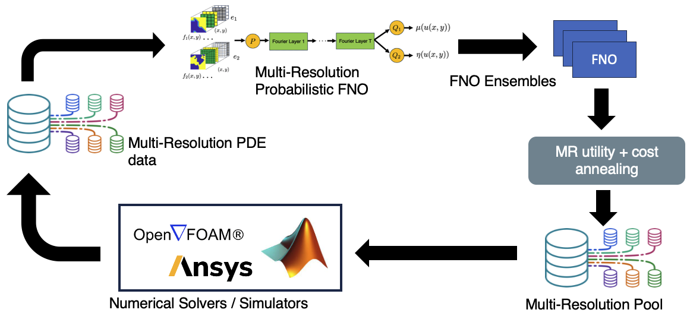

# *MRA-FNO*: Multi-Resolution Active Learning of Fourier Neural Operators. 

by [Shibo Li](https://imshibo.com), [Xin Yu](https://yuxwind.github.io/), [Wei Xing](https://wxing.me/), [Mike Kirby](https://www.cs.utah.edu/~kirby/), [Akil Narayan](http://www.sci.utah.edu/~akil/) and [Shandian Zhe](https://www.cs.utah.edu/~zhe/)

<p align="center">
    <br>
    
    <br>
<p>

<h4 align="center">
    <p>
        <a href="https://arxiv.org/abs/2309.16971">Paper</a> 
        <!-- <a href="https://github.com/shib0li/Adjoint-MAML/blob/main/images/amaml-slides.pdf">Slides</a>  -->
<!--         <a href="https://github.com/shib0li/Infinite-Fidelity-Coregionalization/blob/main/images/poster.pdf">Poster</a>  -->
    <p>
</h4>


Fourier Neural Operator (FNO) is a popular operator learning framework, which not only achieves the state-of-the-art performance in many tasks, but also is highly efficient in training and prediction. However, collecting training data for the FNO is a costly bottleneck in practice, because it often demands expensive physical simulations. To overcome this problem, we propose Multi-Resolution Active learning of FNO (MRA-FNO), which can dynamically select the input functions and resolutions to lower the data cost as much as possible while optimizing the learning efficiency. Specifically, we propose a probabilistic multi-resolution FNO and use ensemble Monte-Carlo to develop an effective posterior inference algorithm. To conduct active learning, we maximize a utility-cost ratio as the acquisition function to acquire new examples and resolutions at each step. We use moment matching and the matrix determinant lemma to enable tractable, efficient utility computation. Furthermore, we develop a cost annealing framework to avoid over-penalizing high-resolution queries at the early stage. The over-penalization is severe when the cost difference is significant between the resolutions, which renders active learning often stuck at low-resolution queries and inferior performance. Our method overcomes this problem and applies to general multi-fidelity active learning and optimization problems. We have shown the advantage of our method in several benchmark operator learning tasks. 


# System Requirements

See ``` environment.yml ```, note that please stick with Pytorch 1.xx


# Run

See examples of ``` deploy.sh ```


# License

*MRA-FNO* is released under the MIT License, please refer the LICENSE for details

# Getting Involved
Feel free to submit Github issues or pull requests. Welcome to contribute to our project!

To contact us, never hestitate to send an email to `shibo@cs.utah.edu` or `shiboli.cs@gmail.com` 
<br></br>


# Citation
Please cite our paper if you find it helpful :)


<br></br>
